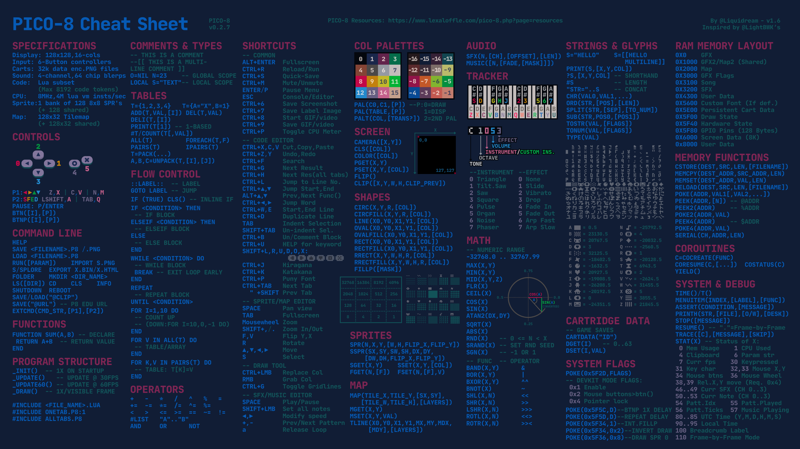
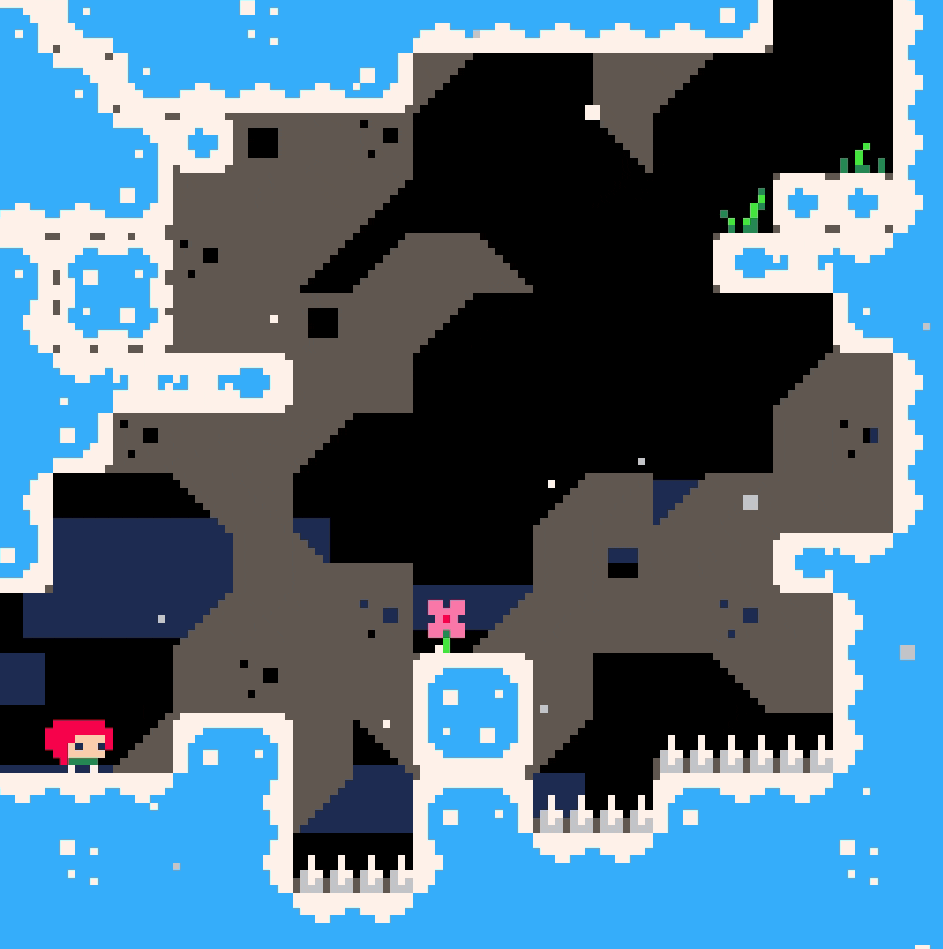
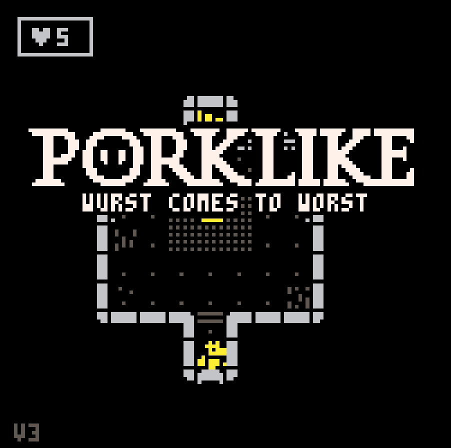
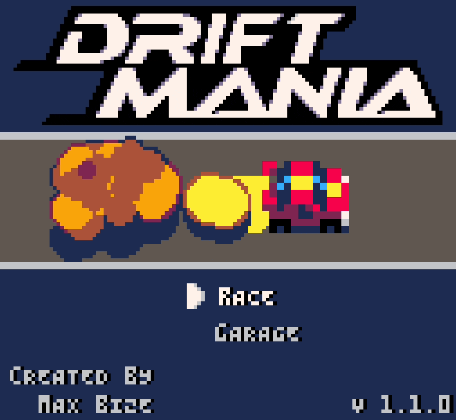

# PICO8

  
Commands

[PICO8 cheatsheet](https://www.lexaloffle.com/bbs/?tid=54246)

  
Celeste

# Celeste

## 🎮 Entities

### 🧍 Player & Player-related

* `player`
* `player_spawn`
* `dead_particles` (player death effect)
* `hair` (visual sub-component of player)

---

### 🌫️ Environment / Visual Effects

* `clouds`
* `particles` (ambient background particles)
* `smoke`
* `dead_particles` (death explosion particles)

---

### 🧱 World / Terrain Objects

* `fall_floor` (breakable platform)
* `platform` (moving platform)
* `fake_wall` (breakable wall via dash)
* `spring` (bounce pad)

---

### 🎈 Interactive Objects

* `balloon` (refills dash)
* `orb` (power-up: increases dash count)
* `key`
* `chest`
* `big_chest`

---

### 🍓 Collectibles

* `fruit`
* `fly_fruit`
* `lifeup` (score popup)

---

### 🪧 UI / Feedback / Narrative

* `message` (text display trigger)
* `room_title` (level title display)
* `flag` (end-level stats display)

---

### 🧩 System / Object Framework

* `objects` (all active entities)
* `types` (entity definitions registry)

---

## ⚙️ Game Mechanics

### 🕹️ Core Movement

* Left / right movement with acceleration & deceleration
* Gravity and falling
* Variable fall speed
* Facing direction flip

---

### 🦘 Jump Mechanics

* Normal jump
* **Coyote time** (`grace` frames after leaving ground)
* **Jump buffering** (`jbuffer`)
* Wall jump
* Ground detection

---

### ⚡ Dash System

* Air dash (limited by `djump`)
* Multi-directional dash (8 directions)
* Dash refill (ground, balloon, fruit)
* Dash attack (break walls)
* Dash freeze + screen shake feedback

---

### 🧗 Advanced Movement

* Wall sliding (reduced fall speed)
* Ice physics (reduced acceleration / slippery)
* Momentum preservation

---

### 💀 Death & Respawn

* Spike collision detection
* Falling off screen death
* Death particle explosion
* Room restart with delay

---

### 🧱 Collision System

* Tile-based collision (`solid_at`)
* Ice detection (`ice_at`)
* Object-to-object collision (`collide`)
* Hitboxes per entity
* Moving platforms affecting player

---

### 🌍 Level / Room System

* Grid-based rooms (`room.x`, `room.y`)
* Tilemap-driven entity spawning
* Room transitions (`next_room`)
* Restart room
* Level index calculation

---

### 🎯 Interaction Mechanics

* Springs launch player upward
* Balloons refill dash
* Keys unlock chests
* Fake walls break on dash
* Falling platforms collapse after trigger
* Moving platforms carry player

---

### 🍓 Collection System

* Fruit collection tracking (`got_fruit`)
* Fly fruit escape if dash used
* Score popup (`lifeup`)
* End-level tally (`flag`)

---

### 🔊 Audio / Feedback

* Sound effects (`sfx`, `psfx`)
* Music transitions per level
* Screen shake (`shake`)
* Freeze frames (`freeze`)
* Flash effects (`flash_bg`)

---

### 🎨 Visual Systems

* Animated sprites
* Hair animation (follows player movement)
* Particle systems (ambient + effects)
* Palette swapping (hair color based on dash)
* Screen transitions / flashes

---

### 🧠 Game State

* Title screen vs gameplay
* Start game trigger
* Timer (`frames`, `seconds`, `minutes`)
* Death counter
* Pause player (cutscenes/events)

---

### 📜 UI / Narrative

* Message trigger zones
* Level name display
* End screen stats (time, deaths, fruit)

---

## Progressive version implementation

* **v0.0.1** - Empty code
* **v0.1.1** – Globals variables (`room`, `objects`, `types`, flags like `freeze`, `shake`, `Input`, etc.)
* **v0.1.2** – Helper functions (`clamp`, `appr`, `sign`, `maybe`)
* **v0.2.1** – Tile helpers (`tile_at`, `tile_flag_at`)
* **v0.2.2** – Collision helpers (`solid_at`, `ice_at`, `spikes_at`)
* **v0.3.1** – Object system (`init_object`, `destroy_object`)
* **v0.3.2** – Object base methods (`move`, `move_x`, `move_y`, `collide`, `check`, `is_solid`, `is_ice`)
* **v0.4.1** – Core update loop (`_update`)
* **v0.4.2** – Core draw loop (`_draw`)
* **v0.4.3** – Object rendering helper (`draw_object`)
* **v0.5.1** – Background systems (`clouds`)
* **v0.5.2** – Ambient particles (`particles`)
* **v0.5.3** – Death particles system (`dead_particles`)
* **v0.5.4** – Player death logic (`kill_player`)
* **v0.5.5** – Smoke entity (`smoke`)
* **v0.6.1** – Player base entity (init, basic movement, gravity, draw)
* **v0.6.2** – Player collision integration (ground, walls, spikes)
* **v0.6.3** – Jump system (normal jump, coyote time, jump buffer, wall jump)
* **v0.7.1** – Dash system (directional dash, timers, acceleration, effects)
* **v0.7.2** – Hair system (`create_hair`, `set_hair_color`, `draw_hair`, `unset_hair_color`)
* **v0.7.3** – Audio helper (`psfx`)
* **v0.7.4** – Advanced movement (wall slide, ice physics, momentum)
* **v0.7.5** – Death conditions (spikes, fall, restart trigger)
* **v0.8.1** – Room system (`load_room`, `next_room`, `restart_room`, `level_index`, `is_title`)
* **v0.8.2** – Entity registration system (`types`)
* **v0.8.3** – Player spawn (`player_spawn`)
* **v0.8.4** – Spring (`spring`)
* **v0.8.5** – Falling floor (`fall_floor`)
* **v0.8.6** – Falling floor logic (`break_fall_floor`)
* **v0.8.7** – Spring break logic (`break_spring`)
* **v0.8.8** – Balloon (`balloon`)
* **v0.8.9** – Fruit (`fruit`)
* **v0.8.10** – Flying fruit (`fly_fruit`)
* **v0.8.11** – Score popup (`lifeup`)
* **v0.9.1** – Fake wall (`fake_wall`)
* **v0.9.2** – Key (`key`)
* **v0.9.3** – Chest (`chest`)
* **v0.9.4** – Moving platform (`platform`)
* **v0.9.5** – Message system (`message`)
* **v0.9.6** – Orb (dash upgrade power-up)
* **v0.9.7** – Big chest event (`big_chest`)
* **v0.9.8** – Flag (end-level stats)
* **v0.9.9** – Room title UI (`room_title`)
* **v0.10.1** – Title screen system (`title_screen`, start trigger, flash)
* **v0.10.2** – Game start (`begin_game`)
* **v0.10.3** – Music system (`music_timer`, transitions)
* **v0.10.4** – Tilemap rendering (background, midground, foreground)
* **v0.10.5** – Particle rendering (ambient + death particles)
* **v0.10.6** – Screen effects (shake borders, flash, palette swaps)
* **v0.10.7** – UI rendering (`draw_time`, stats, counters)
* **v0.10.8** – Full integration and polish (timing, physics tuning, edge cases)
* **v1.0.0** – Full review and code diff comparison

---

[PICO8 Celeste](https://www.lexaloffle.com/bbs/?pid=15133)

  
PorkLike

# PorkLike

Here’s a **clean bullet list** of the main **entities** and **game mechanics** found in your code:

---

## 🎮 Entities

### 🧍 Player

* Player (`😐`)
* Player stats (HP, sight, recover, position)
* Player actions (move, attack, use item)

---

### 👾 Enemies / Mobs

* Generic mobs (`mobs`)
* Dead mobs (`dmobs`)
* Enemy types:

  * Basic AI enemies
  * Weeds (passive/aggressive)
  * Reaper
  * Kong
  * Queen (spawner)
  * Boss / special mobs
* Enemy properties:

  * HP, sight, stun, AI behavior
  * Movement (walk, hop, bump)

---

### 🎒 Items / Pickups

* Picks (`picks`)
* Equipment (`eqp`)
* Item types:

  * Health
  * Key
  * Abilities (jump, push, grapple, etc.)
* Item properties:

  * Charges
  * Type
  * Animation

---

### 🌍 World / Map

* Tile map (`tmap`)
* Fog of war (`fog`)
* Void areas (`voids`, `voidmap`)
* Rooms (`rooms`)
* Floor system (`floor`)

---

### 🧱 Tiles / Environment Objects

* Walls / floors
* Doors / gates
* Traps (damage tiles)
* Teleport tiles
* Breakable tiles
* Void tiles

---

### 🎨 Visual / Effects

* Sprites (`sprs`)
* Floating text (`floats`)
* Animations
* Fade effects
* Explosion effects

---

### 🪟 UI Elements

* Windows (`wind`)
* Inventory window (`invwind`)
* HP window (`hpwind`)
* Messages / popups

---

## ⚙️ Game Mechanics

### 🎮 Core Loop

* Turn-based system:

  * Player turn
  * AI turn
  * Environment (weeds) turn

---

### 🚶 Movement

* Grid-based movement
* Collision detection (`isw`)
* Movement types:

  * Walk
  * Hop
  * Bump

---

### ⚔️ Combat

* Damage system (`hitmob`, `hitpos`)
* Stun mechanic
* Enemy attacks
* Area damage (explosions)

---

### 🧠 AI System

* Behavior states:

  * Idle (`ai_wait`)
  * Attack (`ai_attac`)
  * Special behaviors (queen, kong, reaper)
* Pathfinding (`calcdist`, `getnextstep`)
* Line of sight (`los`)

---

### 🎯 Abilities System

* Directional targeting
* Ability types:

  * Jump
  * Shoot
  * Push
  * Grapple
  * Spin attack
* Charges per item

---

### 🎒 Inventory System

* 4-slot equipment
* Item selection
* Item usage (consume charges)
* Description system

---

### 🗝️ Progression

* Floors (procedural levels)
* Keys and locked doors
* Exit tile (next floor)
* Win condition (final floor)

---

### 🧱 Procedural Generation

* Room generation
* Maze carving
* Door linking
* Spawn system (enemies + items)
* Decoration system

---

### 🌫️ Visibility / Fog of War

* Limited sight radius
* Fog clearing (`unfog`)
* Blind status effect

---

### 💥 Environment Interaction

* Breakable walls
* Explosions (`boom`)
* Tile transformations
* Teleportation

---

### 📊 Stats & Tracking

* Steps counter
* Kill counter
* Chain system
* Persistent data (`dset`, `dget`)

---

### 🎵 Feedback Systems

* Sound effects (`sfx`)
* Music (`music`)
* Visual feedback (flash, floats)

---

### 💀 Game Over / Win

* Death handling
* Restart system
* Win screen

---

## Progressive version implementation

* **v0.0.1** – Empty code
* **v0.1.1** – Core globals (`t`, `floor`, `turn`, `key`, `win`, `chain`, `steps`, etc.)
* **v0.1.2** – Direction tables (`dirx`, `diry`, `dirpos`, `invdir`)
* **v0.1.3** – Data tables (`mob_ani`, `mob_type`, `mob_hp`, `mob_brain`, `pick_name`, `pick_desc2d`)
* **v0.1.4** – String/table helpers (`explode`, `explode2d`, `explodeval`, `toval`)
* **v0.1.5** – Math/helpers (`find`, `dist`, `mysgn`, `getrnd`, `getframe`)
* **v0.2.1** – PICO-8 entry points (`_init`, `_update60`, `_draw`)
* **v0.2.2** – Game start system (`startgame`)
* **v0.2.3** – Fade system (`dofade`, `fadeout`, `wait`)
* **v0.2.4** – Main update state routing (`_upd`)
* **v0.2.5** – Main draw state routing (`_drw`)
* **v0.3.1** – Map coordinate helpers (`xytopos`, `postoxy`, `postoscreen`)
* **v0.3.2** – Blank map creation (`blankmap`)
* **v0.3.3** – Tile walkability helper (`isw`)
* **v0.3.4** – Tile copying from map (`copymap`)
* **v0.3.5** – Tile bump interaction (`bumptile`)
* **v0.3.6** – Tile hit interaction (`hitpos`)
* **v0.3.7** – Wall/neighbor reset logic (`resetneighs`, `dirt`)
* **v0.4.1** – Player entity setup (`😐`)
* **v0.4.2** – Player movement (`moveplayer`)
* **v0.4.3** – Movement animation helpers (`mobwalk`, `mobbump`, `mobhop`)
* **v0.4.4** – Movement animation functions (`mov_walk`, `mov_bump`, `mov_hop`)
* **v0.4.5** – Direction/flip handling (`mobdir`)
* **v0.4.6** – Step trigger logic (`trig_step`)
* **v0.5.1** – Mob creation (`addmob`)
* **v0.5.2** – Mob lookup (`getmob`)
* **v0.5.3** – Mob damage/death (`hitmob`)
* **v0.5.4** – Dead mob rendering list (`dmobs`)
* **v0.5.5** – Object mobs / breakables (`openob`)
* **v0.5.6** – Explosion system (`boom`)
* **v0.6.1** – Turn system (`turn`, `passturn`)
* **v0.6.2** – Player turn update (`update_game`)
* **v0.6.3** – Animation update loop (`update_anis`)
* **v0.6.4** – Game over update (`update_gover`)
* **v0.6.5** – Win/death result screen (`showgover`, `draw_gover`)
* **v0.7.1** – Line of sight (`los`)
* **v0.7.2** – Sight detection (`sight`)
* **v0.7.3** – Fog map (`fog`)
* **v0.7.4** – Fog reveal (`unfog`, `unfogtile`)
* **v0.7.5** – Blind status effect (`blind`)
* **v0.8.1** – AI turn runner (`doai`)
* **v0.8.2** – Passive AI (`ai_blank`, `ai_wait`)
* **v0.8.3** – Basic attack AI (`ai_attac`)
* **v0.8.4** – Weed AI (`ai_weed`)
* **v0.8.5** – Reaper AI (`ai_reaper`)
* **v0.8.6** – Kong AI (`ai_kong`)
* **v0.8.7** – Queen AI / summoner (`ai_queen`)
* **v0.8.8** – AI bump attack (`ai_dobump`)
* **v0.8.9** – AI target checking (`ai_tcheck`)
* **v0.8.10** – Pathfinding distance map (`calcdist`)
* **v0.8.11** – AI path selection (`getnextstep`)
* **v0.9.1** – Pickup creation (`addpick`)
* **v0.9.2** – Pickup lookup (`getpick`)
* **v0.9.3** – Pickup collection (`pickup`)
* **v0.9.4** – Random item drops (`droppick_rnd`)
* **v0.9.5** – Item drop positioning (`droppick`, `dropspot`)
* **v0.9.6** – Equipment inventory (`eqp`)
* **v0.9.7** – Inventory opening/closing (`showinv`, `hideinv`)
* **v0.9.8** – Inventory update (`update_inv`)
* **v0.9.9** – Item description window (`updatedesc`)
* **v0.10.1** – Targeting mode (`update_targ`)
* **v0.10.2** – Direction arrow rendering (`drawarrow`)
* **v0.10.3** – Ability execution (`eat`)
* **v0.10.4** – Jump ability
* **v0.10.5** – Bolt/shoot ability (`shoot`)
* **v0.10.6** – Push ability (`mobpush`)
* **v0.10.7** – Grapple / rope ability (`rope`)
* **v0.10.8** – Spear ability
* **v0.10.9** – Smash ability
* **v0.10.10** – Hook ability
* **v0.10.11** – Spin ability
* **v0.10.12** – Suplex ability
* **v0.10.13** – Slap ability
* **v0.11.1** – UI window system (`addwind`, `drawind`)
* **v0.11.2** – Floating text (`addfloat`)
* **v0.11.3** – Message popup (`showmsg`)
* **v0.11.4** – HP window (`dohpwind`)
* **v0.11.5** – Key/floor UI
* **v0.11.6** – Inventory UI
* **v0.11.7** – Description UI
* **v0.12.1** – Sprite helper (`myspr`)
* **v0.12.2** – Mob drawing (`drawmob`)
* **v0.12.3** – Main game drawing (`draw_game`)
* **v0.12.4** – Tilemap rendering
* **v0.12.5** – Pickup rendering
* **v0.12.6** – Effect sprite rendering (`sprs`)
* **v0.12.7** – Floating text rendering
* **v0.12.8** – Fade/flash rendering
* **v0.12.9** – Logo/title overlay rendering
* **v0.13.1** – Floor generation entry (`genfloor`)
* **v0.13.2** – Procedural map generator (`mapgen`)
* **v0.13.3** – Room placement (`placeroom`, `doesroomfit`)
* **v0.13.4** – Maze carving (`digworm`, `cancarve`)
* **v0.13.5** – Signature helpers (`getsig`, `bcomp`, `sigarray`)
* **v0.13.6** – Room connection / door carving
* **v0.13.7** – Flood fill region flags (`growflag`)
* **v0.13.8** – Dead-end filling
* **v0.13.9** – Pretty wall generation
* **v0.13.10** – Void generation
* **v0.13.11** – Chest placement
* **v0.13.12** – Decoration placement
* **v0.13.13** – Enemy spawning (`spawnmobs`)
* **v0.14.1** – Gate / locked door system
* **v0.14.2** – Key holder enemy logic
* **v0.14.3** – Exit tile / next floor logic
* **v0.14.4** – Final floor / win condition
* **v0.14.5** – Chain persistence (`dget`, `dset`)
* **v0.14.6** – Stats tracking (`st_steps`, `st_kills`)
* **v0.15.1** – Sound effects integration (`sfx`)
* **v0.15.2** – Music integration (`music`)
* **v0.15.3** – Screen fade polish
* **v0.15.4** – Animation timing polish
* **v0.15.5** – Combat feedback polish
* **v0.15.6** – UI polish
* **v0.15.7** – Balance pass: enemies, drops, floor difficulty
* **v0.15.8** – Edge case review: blocked movement, nil mobs, invalid drops
* **v1.0.0** – Full review and code diff comparison

[PICO8 PorkLike](https://www.lexaloffle.com/bbs/?tid=37045)

  
Drift Mania

# Drift Mania

[PICO8 Drift Mania](https://www.lexaloffle.com/bbs/?tid=37045)

