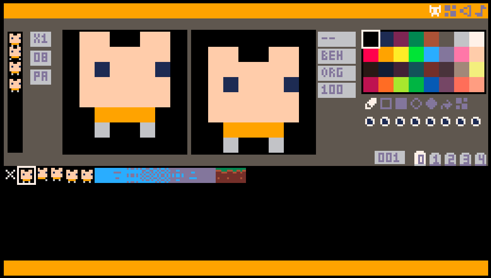

# Mono8 Web

A PICO-8 style game engine with built-in sprite, map, SFX and music editors — running in the
browser on **Blazor WebAssembly**. The screen is 256×144 pixels with a 32-color palette.

This repository has **two heads that share one engine**:

| Folder | Head | Runtime |
|---|---|---|
| [`src/`](src/) | Desktop | MonoGame.Framework.DesktopGL (.NET 8) |
| [`web/`](web/) | Browser | [KNI](https://github.com/kniEngine/kni) (BlazorGL) — nkast's WebAssembly-compatible MonoGame/XNA fork |

The `web/` project compiles the same `src/**/*.cs` engine sources against KNI instead of
MonoGame.DesktopGL (browser-only differences are guarded by the `BLAZORGL` compile define). The full
engine, editor and API documentation lives in **[src/README.md](src/README.md)**.



## Run the web build

```
dotnet run --project web
```

Then open the URL it prints (default `http://localhost:5259`). The first build restores the KNI
packages from nuget.org, so it can take a while.

The web head boots Blazor, seeds the `data.*` files into the browser's in-memory filesystem, matches
the engine's audio rate to the browser's `AudioContext` (and resumes that context on the first user
gesture so sound actually plays), and drives the game loop from `requestAnimationFrame`. Editor
changes written to disk (cart import, `dset`) are mirrored to `localStorage`, so they survive a page reload.

## Publish to itch.io

See **[PUBLISHING.md](PUBLISHING.md)** — the `dotnet publish` → prune → zip recipe plus the itch.io
project settings (HTML kind, 1280×720 viewport, fullscreen launch) and the gotchas around audio
gestures, iframe focus and `localStorage` persistence.

## Build the desktop app

See **[src/README.md](src/README.md)** — it documents building/publishing the desktop head plus the
complete editor and PICO-8-style API reference (shared by both heads).

## Browser controls

Keyboard and mouse work as documented in [src/README.md](src/README.md), with these differences:

- `Alt+F4` (quit) and `F2` (fullscreen) are desktop-only — a browser tab owns its own lifetime and
  fullscreen. Use the browser's own fullscreen (`F11`) for now.
- The two **Save/Load** buttons at the far top-left of the menu bar export/import the whole
  `data.mono8` cartridge through the browser's download / file-picker dialogs.
- Press **`Tab`** to open the [Ace](https://ace.c9.io/) Lua code editor overlaid on the canvas, and
  **`Shift+Tab`** to commit your edits and return. The engine is paused while it's open. Edits land in
  the same `__lua__` source that `Ctrl+R` runs and the **Save** button exports.
- Everything else — the editors, painting, hotkeys — behaves the same.

## Blazor WebAssembly — porting status & TODO

### Done (scaffolding)
- [x] KNI / BlazorGL Blazor WebAssembly head in [`web/`](web/).
- [x] Shared-source compile: `web/web.csproj` globs `..\src\**\*.cs` (excluding the desktop `Program.cs`).
- [x] `data.*` files embedded and seeded into the WASM in-memory filesystem on boot.
- [x] Audio sample-rate matched to the browser `AudioContext`.
- [x] `requestAnimationFrame` → `TickDotNet` game loop; right-click context menu suppressed.

### Fixed (this pass)
- [x] **Clicks now register.** The scene render target is created at a fixed 256×144
      ([Mono8Game.cs](src/Mono8Game.cs)) so the final blit source — and therefore the
      mouse→virtual-pixel mapping in [MouseInput.cs](src/core/input/MouseInput.cs) — lines up with
      the on-screen UI. Previously the browser's full-canvas backbuffer made the target canvas-sized,
      so the game rendered into a corner and every click missed every button.
- [x] **Integer scaling removed for the browser.** [Screen.cs](src/core/graphics/Screen.cs) now
      fills the canvas with a single float aspect-fit scale (16:9 preserved, remainder letterboxed)
      instead of snapping to whole multiples. Desktop keeps whole-multiple scaling.
- [x] **Window resize handled.** A `resize` listener resizes the canvas backbuffer and calls back
      into the engine to recompute the letterbox ([index.html](web/wwwroot/index.html),
      [Index.razor.cs](web/Pages/Index.razor.cs)).
- [x] **Desktop-only keys guarded** (`Alt+F4`, `F2`) under `#if !BLAZORGL`.
- [x] **Persistence across reloads** via `localStorage` (`FileIO.OnWrite` hook +
      [Index.razor.cs](web/Pages/Index.razor.cs) restore).
- [x] **Audio plays in the browser.** Browsers create every `AudioContext` suspended and only let it
      start from inside a user-gesture handler, but KNI never resumes its context and sounds fire a
      frame later from `requestAnimationFrame`, so nothing ever played. The constructor is wrapped in
      [index.html](web/wwwroot/index.html) to track every context KNI creates and resume them on the
      first `pointerdown`/`keydown`/`touchstart`.
- [x] **Iframe scroll suppression** for itch.io embedding: `Arrow`/`Space` and mouse-wheel events are
      prevented from scrolling the outer page ([index.html](web/wwwroot/index.html)).
- [x] **Browser-friendly error surfacing.** The init path logs the real inner exception to the
      console instead of the opaque "type initializer threw" wrapper
      ([Index.razor.cs](web/Pages/Index.razor.cs), [ErrorHandler.cs](src/core/common/ErrorHandler.cs)).
- [x] **Single-file cartridge (`data.mono8`).** The whole cart is one PICO-8-style sectioned file
      (`__lua__`, `__gfx__`, `__gff__`, `__atl__`, `__map__`, `__sfx__`, `__music__`), parsed/built by
      [DataFile.cs](src/core/common/DataFile.cs). It is rewritten in one write.
- [x] **Cartridge Save/Load.** Two menu-bar buttons export/import `data.mono8` through the browser's
      download and file-picker dialogs, bridged by [CartIO.cs](src/core/common/CartIO.cs) +
      [Index.razor.cs](web/Pages/Index.razor.cs).
- [x] **Lua games.** Game logic is written in Lua in the `__lua__` section and run by an embedded
      MoonSharp interpreter ([LuaGame.cs](src/game/LuaGame.cs)); `Ctrl+R` runs it, `Esc` returns.
- [x] **Ace Lua code editor.** `Tab` opens a vendored, offline [Ace](https://ace.c9.io/) editor
      overlaid on the canvas (DepartureMono pixel font, PICO-8 dark theme, Lua syntax highlighting);
      `Shift+Tab` commits and returns. The engine tick pauses while it's open so keys don't leak into
      engine shortcuts ([index.html](web/wwwroot/index.html), [Index.razor.cs](web/Pages/Index.razor.cs)).
- [x] **itch.io publish recipe.** `dotnet publish` → prune `.br`/`.gz` → zip with `index.html` at the
      root, plus the itch project settings and embed gotchas — documented in [PUBLISHING.md](PUBLISHING.md).

### Open / refinements
- [ ] **DPR-aware crisp canvas.** The backbuffer is sized in CSS pixels (so mouse coords stay 1:1);
      rendering at `devicePixelRatio` would sharpen it, but needs KNI's mouse coordinate space
      verified so clicks stay aligned.
- [ ] **`F2` → browser Fullscreen API** via JS interop (currently a no-op in the browser).
- [ ] **IndexedDB persistence** for larger data / robustness (localStorage is enough for now).
- [ ] **Touch input** for the editors on tablets/phones (currently mouse/keyboard only).
- [ ] Confirm [`web/Content/webContent.mgcb`](web/Content/webContent.mgcb) needs no baked content
      (the engine builds its textures at runtime from the `data.*` files).

## TODO Items

- [x] Compare desktop version with Web and fix any issues
- [x] List/map all hotkeys in all editor modes to analyze if makes sense in web
- [x] Extend the index.html:196-202 keydown handler to preventDefault() on Ctrl+S  (Save) and Ctrl+R (Run game)
- [x] Change data logic. Instead of multiple files, have a single file Separate with "__{extension name}__" like in pico8. use "name.mono8" for this single file
- [x] Add a button on top menu bar to be able to save/load single data.
- [x] Add MoonSharp to be able to create game using Lua instead
- [x] Add a logic to also load/save lua code in this single file. 
- [x] Limit lua code to 524288 characters
- [x] Add AceEditor to blazor web with Lua. Tab/shift tab to toogle between Editor and AceEditor. AceEditor should be in JS with pixel art font and font size to not be small and not to big and dark mode to match the current look and feel
- [x] In Lua editor (ace editor), Ctrl+R should go back to editor LuaGame
- [x] Add display name using event for all menu buttons at top menu bar when hovering mouse over buttons. 
- [x] if click save cart at top menu bar, show dark grey background instead of current editor with "saving cart..." at center of screen and pause any current logic. after user save/cancel explorer dialog, go back to last editor